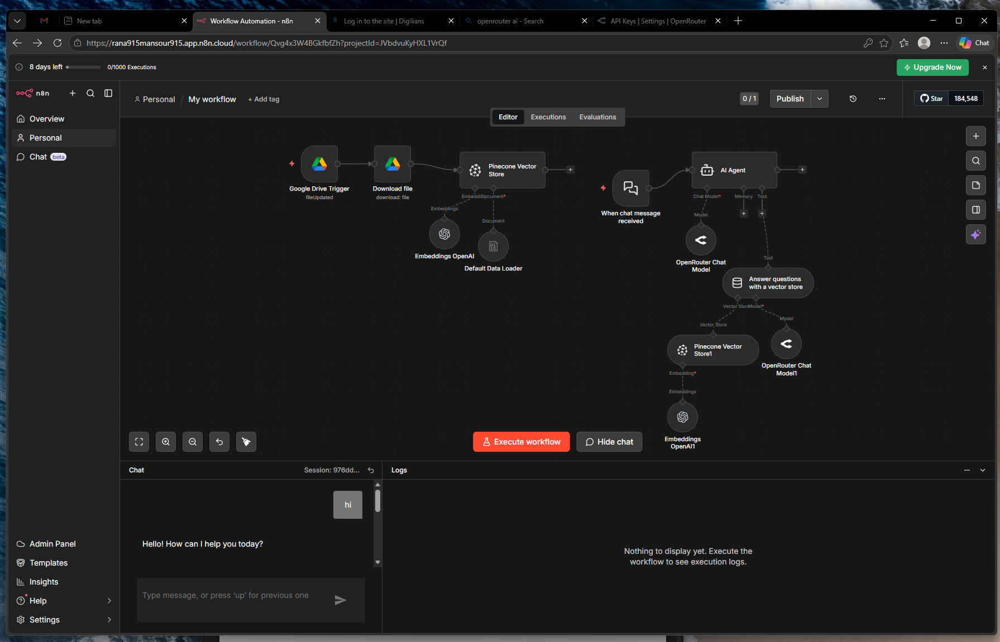

# 🚀 AI-Powered RAG Chatbot with n8n, Pinecone & OpenRouter

An end-to-end Retrieval-Augmented Generation (RAG) system built using **n8n**, **Pinecone**, **OpenRouter**, **OpenAI Embeddings**, and **Google Drive**.

This project automatically ingests PDF documents from Google Drive, converts them into vector embeddings, stores them inside Pinecone, and enables users to chat with their documents using an AI Agent.

---

# 📌 Project Overview

This workflow provides a complete AI document assistant system with:

- 📂 Automatic PDF ingestion from Google Drive
- ✂️ Smart text chunking using Recursive Character Text Splitter
- 🧠 Vector embeddings using OpenAI
- 🗄️ Vector database storage using Pinecone
- 🤖 AI Agent capable of answering questions from uploaded PDFs
- 💬 Interactive chat interface inside n8n
- 🔍 Semantic search with Retrieval-Augmented Generation (RAG)

---

# 🏗️ System Architecture

```text
Google Drive → PDF Processing → OpenAI Embeddings → Pinecone Vector DB
                                                    ↓
                                            AI Agent + RAG
                                                    ↓
                                           Context-Aware Answers
```

---

# 🛠️ Tech Stack

| Technology | Purpose |
|---|---|
| n8n | Workflow automation |
| Pinecone | Vector database |
| OpenAI Embeddings | Text embeddings |
| OpenRouter | LLM provider |
| Google Drive API | File ingestion |
| RAG Architecture | Context-aware AI responses |

---

# ⚙️ Main Features

✅ Automated PDF ingestion  
✅ AI-powered semantic search  
✅ Context-aware chatbot  
✅ Vector database integration  
✅ AI Agent with memory  
✅ Scalable RAG architecture  
✅ No-code/Low-code automation  

---

# 📸 Workflow Screenshot

## Main Workflow



---

# 🧠 AI Workflow Logic

## PDF Ingestion Flow

```text
Google Drive Trigger
        ↓
Download PDF
        ↓
Extract Text
        ↓
Split into Chunks
        ↓
Generate Embeddings
        ↓
Store in Pinecone
```

---

## RAG Chat Flow

```text
User Question
      ↓
AI Agent
      ↓
Search Pinecone
      ↓
Retrieve Relevant Chunks
      ↓
Generate Context-Aware Answer
```

---

# 🔑 Required Services

Before running the project, create accounts and API keys for:

- OpenAI
- OpenRouter
- Pinecone
- Google Cloud Console
- n8n Cloud / Self-hosted n8n

---

# 📦 Pinecone Configuration

| Setting | Value |
|---|---|
| Index Type | Serverless |
| Dimensions | 1536 |
| Metric | Cosine |
| Namespace | pdf-docs |

---

# 🧠 Embedding Model

```text
text-embedding-3-small
```

---

# 🤖 LLM Model

```text
gpt-4o-mini
```

(through OpenRouter)

---

# 🚀 How to Run

## 1️⃣ Clone Repository

```bash
git clone https://github.com/rana1elmazeny/AI-Powered-RAG-Chatbot-with-n8n.git
cd YOUR_REPO
```

---

## 2️⃣ Start n8n

```bash
docker run -it --rm \
-p 5678:5678 \
n8nio/n8n
```

---

## 3️⃣ Configure Credentials

Inside n8n configure:

- OpenAI API Key
- OpenRouter API Key
- Pinecone API Key
- Google Drive OAuth

---

## 4️⃣ Upload PDFs

Upload PDF files into the connected Google Drive folder.

The workflow will automatically:

- Download PDFs
- Extract text
- Create embeddings
- Store vectors in Pinecone

---

## 5️⃣ Start Chatting

Use the built-in n8n chat interface to ask questions like:

```text
Summarize the uploaded PDF.
What are the key concepts in the document?
Explain the main idea.
```

---

# 🐞 Troubleshooting

## Trigger Not Working

- Ensure Google Drive OAuth permissions include file access.

## Pinecone Returns Empty Results

- Verify namespace names match exactly.

## AI Agent Not Using Pinecone

- Ensure Pinecone is connected as a Tool to the AI Agent.

---

# 🔮 Future Improvements

- OCR support
- Metadata filtering
- Duplicate detection
- Multi-user support
- Web dashboard
- Streaming AI responses
- Slack/Discord integration

---

# 👨‍💻 Author

Rana Elmazeny
DevOps & Cloud Engineer  
AWS | Kubernetes | AI Automation | DevOps


---

# ⭐ Support

If you found this project useful, give it a ⭐ on GitHub.
